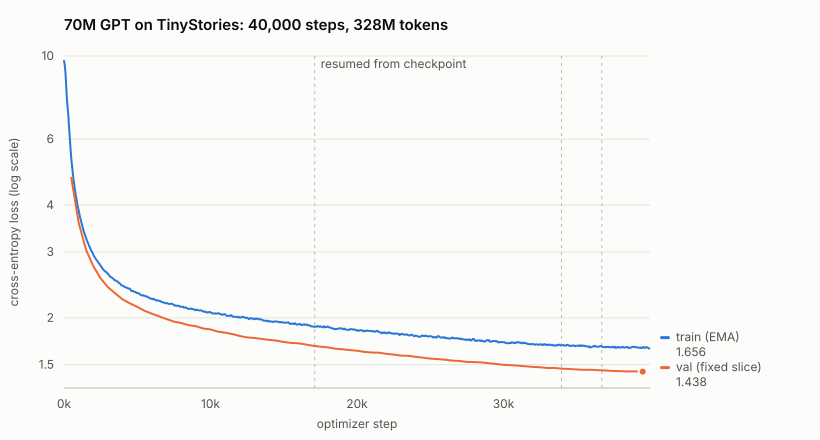

# grad.cpp

[](https://github.com/liamford1/grad.cpp/actions/workflows/ci.yml)

A from-scratch autograd engine and the GPT-style language models it trains, implemented in C++20: tensors, reverse-mode automatic differentiation with hand-derived backward passes, multi-head attention, AdamW, and a BPE tokenizer, with no ML frameworks. The only external dependency is a BLAS library (Apple Accelerate on macOS, OpenBLAS on Linux) for fast matrix multiplication.

The largest model trained with it so far is a **70M-parameter GPT trained from scratch on TinyStories**: 40,000 optimizer steps, 328M tokens and 37 hours on a single M2 Pro. It reaches a held-out loss of 1.693 (perplexity 5.44). Here is a sample from it, at temperature 0.8, the first draw, unedited:

> **Once upon a time, there was a little dragon who** wanted to meet someone else. He flew around and saw an old lady. She smiled at the dragon, and said, "Hello! My name is Frank." The big queen thought this sounded like fun, so she asked Frank if he would join her for some fun. Then, they became best friends. They went on adventures together, learning to be as friendly with one another.

Every gradient that trained it was derived and implemented by hand. The [run report](docs/runs/2026-09-tinystories-70m/README.md) has the full configuration, loss curves, a checkpoint evaluation, more samples, and an audit finding: the trainer's in-loop validation read 0.25 nats optimistic, and that has since been fixed.



## What's inside

- **Tensor library** (`tensor.h/cpp`): 2D/3D float tensors with BLAS-backed matmul, broadcasting, and numerically stable softmax/log-softmax
- **Reverse-mode autograd** (`variable.h/cpp`): dynamic computation graph with hand-derived backward passes for every op, validated against numerical gradients
- **Transformer components**: multi-head self-attention with causal masking, pre-LayerNorm residual blocks, GELU feed-forward, learned positional embeddings, and weight tying between the token embedding and the output projection
- **BPE tokenizer**: byte-pair encoding trained on the corpus, with caching so repeat runs start instantly
- **Training stack**: AdamW (decoupled weight decay, matrices only) with linear warmup + cosine LR decay, gradient accumulation, gradient clipping, seeded dropout (each mask is a pure function of seed, stream and position, so it does not depend on thread scheduling), a memory-mapped data pipeline for multi-GB corpora, resumable validated checkpoints written atomically, per-step metrics, and held-out validation during training
- **Text generation and evaluation**: KV-cached incremental decoding (`inference.h`), greedy or sampled with temperature, top-k, top-p, and a repetition penalty; `grad eval` scores a checkpoint on sampled or full held-out data
- **Tooling**: a live terminal training dashboard (`grad watch`), a self-resuming training supervisor, a benchmark harness with repeated trials and JSON provenance, and a PyTorch baseline for head-to-head comparisons

About 8,300 lines of implementation and 2,300 lines of tests.

## Trained models

| | Tiny Shakespeare | TinyStories |
|---|---|---|
| Preset | `small` | `medium` |
| Parameters | ~22M | 69.8M |
| Shape | d512 × 6 layers × 8 heads, FFN 2048 | d768 × 8 layers × 12 heads, FFN 3072 |
| Vocabulary | 5,000 BPE tokens | 16,000 BPE tokens |
| Context at training time | 96 tokens | 256 tokens |
| Batch | 8 sequences | 8 × 4 accumulation = 32 sequences |
| Optimizer | AdamW, lr 3e-4, 500 warmup, dropout 0.1 | AdamW, lr 3e-4, 1,000 warmup, no dropout |
| Held-out loss | n/a | 1.693 (perplexity 5.44), [run report](docs/runs/2026-09-tinystories-70m/README.md) |

Both are standard GPT-2-style decoder-only transformers: pre-LayerNorm residual blocks, GELU feed-forward, learned positional embeddings, and weight tying between the token embedding and the output projection. A `modern` preset swaps in the Llama-style block (see below).

## Build and run

Requires CMake ≥ 3.16 and a C++20 compiler (GCC 11+, Clang 14+, or Xcode 15+). On Linux, install OpenBLAS first (`sudo apt-get install libopenblas-dev`); macOS uses the built-in Accelerate framework.

```bash
cmake -S . -B build -DBUILD_TESTS=ON
cmake --build build -j
```

Common commands:

```bash
# Quick end-to-end smoke test: trains a tiny model for 50 steps (~1 min)
./build/grad train-fast

# Full training run on Tiny Shakespeare (produces shakespeare_final.bin)
./build/grad train

# Sample from a trained checkpoint (vocab is read from the checkpoint)
./build/grad generate shakespeare_final.bin "ROMEO:"
./build/grad generate shakespeare_final.bin "ROMEO:" --temperature 0.6 --top-k 40 --max-tokens 300

# Score a checkpoint on 500 sampled batches of held-out and training windows
./build/grad eval tinystories_best.bin data/tinystories.txt 16000 256 500
./build/grad eval tinystories_best.bin data/tinystories.txt --batches 500   # same, by name

# Interactive REPL: type a prompt, watch it stream a continuation
./build/grad chat shakespeare_final.bin

# Reproduce the benchmark with repeated trials and a machine-readable record
./build/grad bench --steps 20 --trials 5 --json grad-benchmark.json

# Pre-tokenize a corpus for fast, memory-mapped training (see below)
./build/grad prepare my_corpus.txt 5000

# List the model/training presets (--json for tools)
./build/grad presets
```

`./build/grad --help` lists the commands, and `./build/grad <command> --help` shows a command's arguments, options, and defaults. Optional arguments can also be given by name (`--corpus`, `--vocab`, `--seq`, ...), so a later one can be set without spelling out those before it. `generate` and `chat` take the decoding settings as flags: `--temperature`, `--top-k`, `--top-p`, `--repetition-penalty`, `--max-tokens`, and `--greedy`.

The first `train` run also trains the BPE tokenizer and caches it (`tokenizer_5000.cache`); later runs reuse the cache. Checkpoints are plain binary dumps of the weights plus hyperparameters, so `generate` can reconstruct the model from the file alone.

The build also produces an installable `grad::core` CMake target:

```bash
cmake --install build --prefix ./dist
```

Downstream CMake projects can use `find_package(grad CONFIG REQUIRED)` and link `grad::core` after adding `dist` to `CMAKE_PREFIX_PATH`.

Release builds are tuned for the build machine with `-march=native` (that is how every number in [BENCHMARKS.md](BENCHMARKS.md) was measured). For a binary you intend to run on another CPU, configure with `-DGRAD_NATIVE_ARCH=OFF`.

## Training on your own corpus

Any plain-text file works. For anything larger than Tiny Shakespeare, pre-tokenize it once:

```bash
./build/grad prepare my_corpus.txt 5000   # writes my_corpus.txt.5000.{train,val}.bin
./build/grad train my_corpus.txt          # memory-maps the .bin files
```

`prepare` trains a BPE tokenizer on the corpus (sampling the first 32MB for merge learning on large corpora, since frequencies converge long before that) and writes the encoded tokens as binary files (uint16 per token, 95/5 train/val split). Training memory-maps them, so the corpus is never re-encoded and usable corpus size is bounded by disk, not RAM: the kernel pages in only the windows each batch actually touches. Without the `.bin` files, `train` falls back to encoding the corpus in memory, which is fine at Tiny Shakespeare scale.

Three model presets are built in (`./build/grad presets` prints every field, including the `fast` smoke-test presets):

| preset | params | config | intended for |
|---|---|---|---|
| `small` (default) | ~22M | d512 × 6L × 8H, seq 96, batch 8, vocab 5k | Tiny Shakespeare |
| `medium` | ~70M | d768 × 8L × 12H, seq 256, batch 8×4 accum, vocab 16k | TinyStories-scale corpora |
| `modern` | ~70M | `medium` with a Llama-style block: RMSNorm, RoPE, bias-free SwiGLU | architecture A/B against `medium` |

`modern` swaps the GPT-2-style block (LayerNorm, learned positional embeddings, GELU FFN) for the recipe used by current LLMs, at the same parameter count and training budget, so a `medium` run and a `modern` run on the same corpus A/B the architecture and nothing else. Checkpoints record their architecture (format v2; older files load as GPT-2-style) and `modern` checkpoints are prefixed `<corpus>_modern_*` so both lineages coexist.

`medium`'s logits matmul crosses the ~10 GFLOP threshold where the Metal GPU backend engages (BENCHMARKS.md #7). Its micro-batch size is set by memory, not compute: one micro-batch peaks at ~4GB of footprint, sized to fit a 16GB machine (BENCHMARKS.md #8–9), and gradient accumulation gives the optimizer an effective batch of 32 at that same peak. Example end-to-end:

```bash
curl -L -o data/tinystories.txt \
  "https://huggingface.co/datasets/roneneldan/TinyStories/resolve/main/TinyStories-train.txt"
./build/grad prepare data/tinystories.txt 16000
./build/grad train data/tinystories.txt medium     # writes tinystories_final.bin
./build/grad chat tinystories_final.bin data/tinystories.txt
```

Every run logs per-step metrics to `<prefix>_metrics.csv`, and a live terminal dashboard renders them: loss curves on a braille canvas (raw + EMA), the validation track with running best, gradient-norm and step-time sparklines, progress and ETA. Open it in a second terminal while training:

```bash
./build/grad watch                      # newest run in this directory
./build/grad watch tinystories_modern   # or a specific run prefix
```

It refreshes once a second, works on finished runs too (the CSV is the run's permanent record), and `q` quits.

Long runs are interruptible: Ctrl-C saves a resume pair (`<prefix>_resume_model.bin` + `<prefix>_resume_state.bin`, holding weights, Adam moments, and schedule position), which is also refreshed at every eval interval, so a crash costs at most a few minutes of work.

```bash
./build/grad train data/tinystories.txt medium resume               # continue where it stopped
./build/grad train data/tinystories.txt medium tinystories_best.bin # warm-start: weights only, fresh schedule
```

A resumed or warm-started run reseeds the data loader (by step position and checkpoint path respectively), so it draws fresh training windows instead of replaying the batches the checkpoint already saw.

`--seed N` (default 42) drives weight initialization, window sampling, and dropout together, for repeating an experiment under a different seed; the default reproduces runs made before the flag existed. Resume such a run with the same `--seed`:

```bash
./build/grad train data/tinystories.txt medium --seed 7
./build/grad train data/tinystories.txt medium resume --seed 7
```

## Performance

Training throughput for the 22M benchmark config vs PyTorch 2.13 on the same M2 Pro (fp32). The PyTorch side ([`benchmarks/pytorch_baseline.py`](benchmarks/pytorch_baseline.py)) builds the identical model with idiomatic fused QKV and `scaled_dot_product_attention`:

| training config | grad.cpp (CPU) | PyTorch (CPU) | PyTorch (MPS GPU) |
|---|---:|---:|---:|
| 22M · d512 L6 · seq 96 | **5,418 tok/s** | 3,685 | 8,112 |

On this specific CPU workload, grad.cpp is 1.5× faster than PyTorch; PyTorch MPS is 1.5× faster than grad.cpp. This is a specialized workload result, not a claim of general framework superiority. The 70M comparison previously shown here was withdrawn after a source-metrics audit found an inconsistent throughput calculation; [BENCHMARKS.md](BENCHMARKS.md) records the correction.

At 70M parameters, training over the full 40,000-step run held a median of **2,540 tokens/s** (3.23s per 8,192-token optimizer step, 10th to 90th percentile 3.20 to 3.44s) with flat memory. See the [run report](docs/runs/2026-09-tinystories-70m/README.md#how-the-run-went). A PyTorch comparison at that scale is pending a rerun under the repeated-trial protocol.

The full optimization history, 1.2 → 7.9 steps/s across 11 measured rounds including null results, is in [BENCHMARKS.md](BENCHMARKS.md). Current benchmark commands run repeated trials, report the median, identify dirty builds, record the compiler/system/backend, and optionally write JSON.

## Tests

```bash
ctest --test-dir build --output-on-failure
```

The test suite checks the parts that are easiest to get silently wrong. Every check counts failures and fails the process; nothing only prints.

- **Gradient checking**: analytical gradients from the autograd engine compared against central-difference numerical gradients, for individual ops through full attention blocks and the whole model, including attention with dropout active
- **Architecture behaviors**: attention bias, weight tying, dropout statistics and mask independence across threads
- **Integration checks**: tiny-sequence overfitting, parity between full-sequence and KV-cached inference for both architectures, the data loader, and rejection of truncated or corrupt checkpoints, token files and tokenizer caches
- **Packaging**: CI builds a small consumer project against the installed `grad::core` CMake package
- **Hardware-aware results**: Metal parity is reported as skipped, not passed, when no Metal device is exposed

CI builds with warnings as errors (`-Wall -Wextra -Wpedantic`) on macOS and Linux, runs the suite, a training smoke test and the package consumer, and runs the suite again under AddressSanitizer and UndefinedBehaviorSanitizer.

## Design notes

- **Explicitness over abstraction.** Every forward and backward pass is readable C++, with no expression templates and no code generation. The autograd graph is a DAG of `Variable` nodes holding closures for their backward functions; `backward()` topologically sorts and walks it.
- **Numerics matter.** Softmax and log-softmax use the max-subtraction trick; the loss path computes log-softmax + NLL rather than softmax + log; gradient checks catch regressions.
- **Performance where it counts.** Profiling showed matmul dominating, so it delegates to BLAS (`blas_wrapper.h`); everything else stays simple. The BPE tokenizer caches merges to make encoding runs fast.
- **The training loop is honest.** Loss decreases because the math is right, not because a framework fixed it. The 70M run above took 37 hours on an M2 Pro, and its complete per-step record is [committed](docs/runs/2026-09-tinystories-70m/metrics.csv).

## Repository layout

```
include/grad/, src/   grad::core (headers install to <prefix>/include/grad/)
  transformer/   tensor, variable (autograd), attention, layer_norm,
                 feedforward, embeddings, transformer_block, gpt_model,
                 optimizer, inference (KV cache), text_gen, Metal backend
  tokenizer/     BPE tokenizer
  data/          datasets, memory-mapped token files, batching dataloader
  training/      trainer (loop, evaluation, checkpointing, resume)
  utils/         metrics log, terminal dashboard, training helpers
include/cli/, src/cli/, src/main.cpp   the grad executable (not installed)
tests/
  unit/          gradient checks and component tests
  integration/   end-to-end sanity and file-format tests
  package/       consumer project for the installed CMake package
benchmarks/      PyTorch baseline for head-to-head comparisons
docs/runs/       run reports with their full metrics
tools/           plot_run.py (metrics CSV to SVG)
train_supervised.sh, training_health.sh   self-resuming run supervisor + health monitor
data/            Tiny Shakespeare corpus (~1.1MB)
```

## Limitations and roadmap

- **The tokenizer drops whitespace structure.** Pre-tokenization splits on whitespace, so newlines and runs of spaces never reach the model, and `_` doubles as the space marker. A byte-level, lossless tokenizer v2 with round-trip tests is next. It is a versioned format change, because existing checkpoints depend on the v1 vocabulary.
- **The Metal backend dispatches synchronously.** It routes matmuls above ~10 GFLOPs to the GPU via zero-copy unified memory. At 22M parameters that threshold is never crossed, since Apple's AMX (CPU) wins below it (BENCHMARKS.md #7). At 70M only the logits matmul crosses it. PyTorch MPS is 1.5× faster at 22M, and closing that gap needs asynchronous command buffers and fused kernels. A CUDA port was attempted earlier and rolled back (see git history).
- **The `Tensor` type special-cases 2D and 3D** instead of carrying a general shape and strides, and evaluation still builds an autograd graph that it immediately discards (no no-grad mode yet).
- Scope: this is a training and inference stack built to be read and measured, not a production serving engine.

## License

MIT
