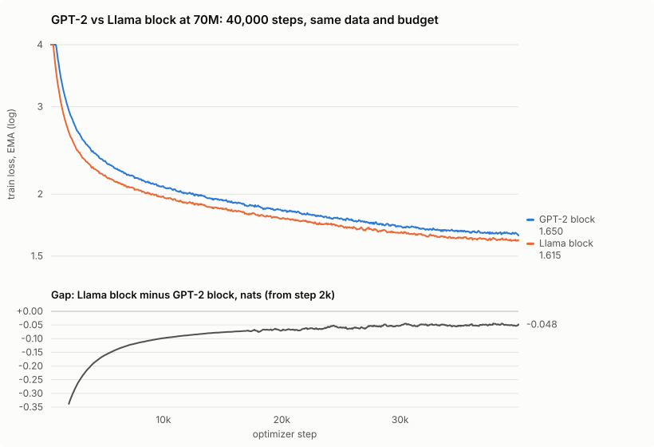

# Run report: GPT-2 block vs Llama block at 70M (September 2026)

A controlled architecture A/B. The [`medium` run](../2026-09-tinystories-70m/README.md) trained a GPT-2-style decoder on TinyStories. This run trained the `modern` preset, the same model with the block that current LLMs use, on exactly the same data, tokenizer, optimizer, schedule and 40,000-step budget. The two runs differ only in the architecture. Both ran on the same Apple M3 Pro, through grad.cpp's own autograd engine.

**Result: the Llama-style block reaches held-out loss 1.647 (perplexity 5.19) against the GPT-2 block's 1.693 (5.44), 0.046 nats better, with 0.8M fewer parameters, at 5% less time per step (part of that is a newer build; see Throughput).**



## What differs

| | `medium` (GPT-2 block) | `modern` (Llama block) |
|---|---|---|
| Normalization | LayerNorm (with bias) | RMSNorm |
| Positions | learned absolute embeddings | rotary (RoPE), no position parameters |
| Feed-forward | GELU, width 3072, with biases | SwiGLU, width 2048 (3 matrices), no biases |
| Parameters | 69,778,944 | 68,961,792 |
| Shared | d768 × 8 layers × 12 heads, 16k BPE v1 vocab, tied embeddings, seq 256, 8 × 4 accumulation, AdamW lr 3e-4, 1,000 warmup steps, cosine to 3e-5, clip 5.0, no dropout, 40,000 steps (328M tokens), loader seed 42 | |

SwiGLU's width 2048 is the usual 8/3 × d_model rounded to a multiple of 64, which keeps its three matrices at roughly the parameter count of GELU's two at width 3072.

## Results

Both checkpoints were scored by `grad eval` with the same seed, so on the same 1,024,000 held-out tokens and the same 1,024,000 training tokens. Re-scoring `medium` with the current binary reproduced its original figure to four decimals, so the two rows are directly comparable:

| checkpoint | val loss | val perplexity | train loss |
|---|---:|---:|---:|
| `medium` best (step 39,500) | 1.6932 | 5.437 | 1.6680 |
| `modern` best (step 39,500) | 1.6488 | 5.201 | 1.6195 |
| `modern` final (step 40,000) | **1.6474** | **5.194** | 1.6181 |

The train/val gap is nearly the same for both architectures (0.025 and 0.029 nats). The Llama block's advantage comes from fitting the distribution better, not from memorizing differently.

**The advantage is largest early and settles at about 0.05 nats.** At matched steps, mean training loss:

| steps | GPT-2 block | Llama block | gap |
|---:|---:|---:|---:|
| 1,000 to 2,000 | 3.227 | 2.895 | −0.332 |
| 5,000 to 6,000 | 2.281 | 2.141 | −0.140 |
| 10,000 to 11,000 | 2.050 | 1.957 | −0.093 |
| 20,000 to 21,000 | 1.847 | 1.781 | −0.066 |
| 30,000 to 31,000 | 1.717 | 1.668 | −0.049 |
| 39,000 to 40,000 | 1.664 | 1.614 | −0.050 |

The Llama-style model reaches the GPT-2 model's final training loss (1.666, mean of its last 1,000 steps) at step 30,220, about 9,800 steps early. At this scale the architecture change is worth roughly a quarter of the training budget. Up to step 17,112 the two runs drew identical batches (same loader seed). The `medium` run resumed there with a loader reseeded from the step position, which is why the gap panel gets noisier from that point.

## Throughput and stability

| | GPT-2 block | Llama block |
|---|---:|---:|
| Median step | 3.23 s | 3.06 s |
| 10th to 90th percentile | 3.20 to 3.44 s | 3.04 to 3.11 s |
| Training time | 37.1 h over 4 sessions | 35.0 h, one session |
| Max gradient norm (clip 5.0), as logged | 3.36 (about 3.6 true) | 2.65 (about 2.8 true) |
| End-of-step RSS, median / max | 1.8 / 2.3 GB | 2.2 / 2.4 GB |

The Llama block is faster per step despite its extra FFN matrix, because RMSNorm, the bias-free layers and RoPE (no position-embedding add or gradient) do less memory-bound work than their GPT-2 counterparts. Its narrower step-time spread partly reflects running in a single uninterrupted session. This run ran from a newer build than `medium` (after the review and refactor work), which measured 4% faster on the `modern` preset in a direct comparison before the run. So part of the step-time difference is the build, not the architecture. The numerics of the two builds are identical, so the loss comparison is unaffected.

Training was clean: no loss spikes, no restarts, and the supervisor never had to intervene. The logged gradient norms read 4 to 11% low: the logging code summed in a float, and has since been fixed. The "true" figures above correct for the bias measured at initialization, where both maxima occurred. The clip used an accurate sum.

## Samples

Sampled at temperature 0.8 from `tinystories_modern_final.bin`, the first draw for each of the prompts used in the `medium` report, unedited, shown up to the end-of-story marker or the 150-token limit (`…`):

> **Once upon a time, there was a little dragon who** lived in the forest. The dragon loved to fly around and explore new places. One day, while flying, he saw an unusual sight. It was an old castle, hidden down amongst all the trees. He decided to enter and see what it was. Inside, there were trees, houses, and even a lot of food! The dragon was very excited for the food, but as soon as he entered, he heard loud noises coming from inside - it sounded like someone trying to steal something! He followed the noise until he came across an old lady. …

> **Tom and his sister Mia found a box in the garden.** They decided to open it together. Inside was something that wanted to destroy the garden! Ben and Mia were very brave too. They moved out of the room with two heads up. Then they ran back into their bedroom and told mom what happened. She smiled at them both for being so brave. Ben and Mia helped their mom plant new garden seeds. The plants grew bigger until it was almost as large as before. They were happy to help. Now the garden was safe from harm when there were harsh winds.

> **The old owl looked at the moon and said,** "Wait, I'm afraid that the moon is too wise for me. You'll never be able to complete that task." Lyla wouldn't understand. Her father was still so flexible, he knew what she wanted and he kissed her on it. A few days later, the old owl finally told Lyla. He had a plan. …

Half a perplexity point is not visible in a handful of samples. Both models write fluent sentences with story structure, and both drift on names across sentences (Tom becomes Ben here).

## Caveats

- **One seed per arm.** Each architecture was trained once. The gap is consistent from step 1,000 to 40,000 and is roughly 30 times larger than the difference between this run's best and final checkpoints (0.0014), but run-to-run variance at a different seed is unmeasured.
- **One scale and budget.** The result is for 70M parameters at 4.7 tokens per parameter. The literature's finding that the Llama recipe helps holds broadly, but its size here is specific to this setup.
- **Same tokenizer limitations as `medium`.** Both runs use the whitespace-lossy v1 tokenizer, so they are comparable with each other, not with results on other tokenizers.
- **In-loop validation is not comparable across the two runs.** This run's trainer scored a fixed subset spread across the whole split. `medium` scored the first 65K tokens, which turned out optimistic (see its report). Only the `grad eval` table above compares them.

## Weights

`tinystories_modern_final.bin` and its tokenizer are published as the [`tinystories-70m-llama` release](https://github.com/liamford1/grad.cpp/releases/tag/tinystories-70m-llama), with SHA-256 checksums and usage. The GPT-2 arm is the [`tinystories-70m` release](https://github.com/liamford1/grad.cpp/releases/tag/tinystories-70m).

## Reproduce

```bash
./train_supervised.sh data/tinystories.txt modern     # same data/prepare step as the medium run
./build/grad eval tinystories_modern_final.bin data/tinystories.txt 16000 256 500
python3 tools/plot_compare.py tinystories_metrics.csv tinystories_modern_metrics.csv ab.svg \
    --labels "GPT-2 block" "Llama block"
```

[`metrics.csv`](metrics.csv) is this run's complete per-step record, and [`loss.svg`](loss.svg) is its standalone loss chart. The `medium` run's record is in [its report](../2026-09-tinystories-70m/metrics.csv).
