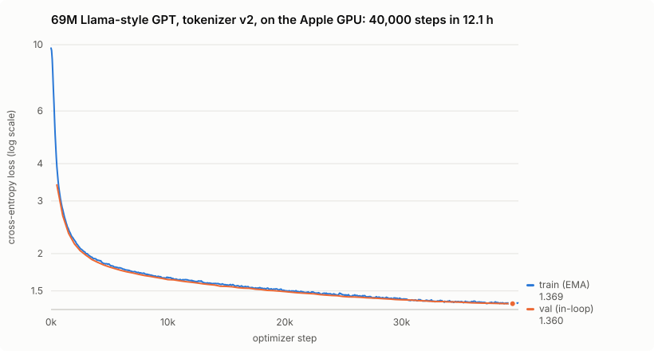

# Run report: the Llama block on tokenizer v2, trained on the Apple GPU (September 2026)

The third 70M-scale run, and the first on the current stack: the `modern` preset (the winner of the [GPT-2 vs Llama A/B](../2026-09-tinystories-modern-ab/README.md)) with the lossless byte-level [tokenizer v2](../../design/tokenizer-v2.md), trained entirely on the GPU in [Metal-resident mode](../../design/metal-resident.md). Same 40,000-step, 8,192-tokens-per-step budget as the two earlier runs.

**Result: held-out 0.4777 bits per byte, in 12.1 hours on one M3 Pro, 2.8× faster than the same model on the CPU. Its output keeps the corpus's paragraph structure, which the earlier models could not represent.**



## Configuration

| | |
|---|---|
| Model | `modern` preset: d768 × 8 layers × 12 heads, RMSNorm, RoPE, bias-free SwiGLU FFN 2048, tied embeddings |
| Parameters | 68,961,792 |
| Tokenizer | v2, byte-level BPE, 16,000 tokens, learned by `grad prepare --tokenizer v2` from the first 32MB of the corpus (1s) |
| Data | `TinyStories-train.txt`, 460.6M v2 tokens (encoded in 12.7s at 509MB/s), contiguous 95/5 split |
| Budget | 40,000 steps × 8,192 tokens = 327.7M tokens, 0.75 epochs |
| Optimizer | AdamW lr 3e-4, 1,000 warmup steps, cosine to 3e-5, clip 5.0, no dropout, loader seed 42 |
| Device | `--device metal`, whole step on the GPU |
| Compute | 12.1 h, one uninterrupted session under `train_supervised.sh`, 2026-09-28 |

## Results

All rows scored by `grad eval` on 1,024,000 uniformly sampled held-out tokens with the same seed. Bits per byte is the loss divided by ln 2 and by the corpus's bytes per token for that tokenizer (v1: 5.035, v2: 4.177), which is what makes the tokenizers comparable at all:

| model | tokenizer | val bits/byte | val loss (per token) | train bits/byte | training time |
|---|---|---:|---:|---:|---:|
| GPT-2 block ([report](../2026-09-tinystories-70m/README.md)) | v1 | 0.4852 | 1.6932 | 0.4780 | 37.1 h, CPU |
| Llama block ([report](../2026-09-tinystories-modern-ab/README.md)) | v1 | **0.4720** | 1.6474 | 0.4637 | 35.0 h, CPU |
| **Llama block, this run** | **v2** | 0.4777 | 1.3832 | 0.4685 | **12.1 h, GPU** |

(The best checkpoint, at step 39,500, scores 0.4779 bits/byte.)

**Reading the comparison.** This run lands between the two v1 runs, 0.006 bits per byte behind the v1 Llama model. Two things work against it, and neither is the architecture or the device:

- **It models more.** v1 collapses every run of whitespace to one space, so it never predicts where a line or paragraph breaks. TinyStories has 14.8M newlines, one every 130 bytes. v2 predicts every one, and v1's bits-per-byte figure still divides by those bytes. v1's figure is therefore flattered, by an amount this comparison cannot separate out.
- **It read less text.** At the same 327.7M-token budget, v2's tokens cover 4.18 bytes each against v1's 5.04, so this run saw about 1.37GB of text to the v1 runs' 1.65GB, 17% less.

The held-out sets also differ slightly: each tokenizer's split is the last 5% of *its* tokens, so the two cover nearly, but not exactly, the same tail of the file. With those caveats, a lossless model that trained on less text finishes within about 1% of the lossy one, in a third of the time.

The train/val gap (0.009 bits per byte) is the same as the v1 Llama run's (0.008), with no sign of overfitting at 0.75 epochs.

## Samples

Sampled at temperature 0.8 from `tinystories_v2_modern_final.bin`, the first draw for each of the same three prompts used in the earlier reports. Unedited, including the line breaks, which the model generated itself. Each is shown to the end of its story (`<|endoftext|>`) or the 180-token limit (`…`):

> **Once upon a time, there was a little dragon who** lived in the woods. He liked to explore and play with his friends all day long! One day, he got very sick and his mom took him to see the doctor. The doctor said that he needed medicine for one of her teeth but it was hidden down in a special place under the trees.
>
> The little dragon was scared, so with a deep breath, he went and found an old man who knew how to heal his tooth. The hero helped him get rid of the medicine from his teeth and gave it to him as a special treat for being brave.
>
> The little dragon was so happy! He thanked the famous doctor for helping him, and then he went home with a big smile on his face. From that day forward, the little dragon never felt scared of medicine again because it gave him the courage to heal.

> **Tom and his sister Mia found a box in the garden.** Inside it was some old paper with pictures of animals, shapes, and even words that sounded funny. Tom took out a pen to write and read about the animals from far away places they did not understand either.
>
> "Look at this!" Tom said to Mia, pointing to a picture of an elephant with big ears, big eyes and long nose. "And what is this?" he asked his sister.
>
> Mia looked at the paper too and tried to learn about it. …

> **The old owl looked at the moon and said,** "I think it's time for you to go home now."
>
> The little bird thanked him and flew away. She had a wonderful time flying in the sky, but she knew that was ok because sometimes things can happen when we are patient and kind. So with one last quick blink of an eye, she flew back to her tree home!

The earlier models' samples were single unbroken blocks, because their tokenizer had no way to represent a line break. These have paragraphs, and dialogue set on its own lines. Names hold across the Tom and Mia sample, where both earlier models drifted, though three samples are not evidence of a trend. The logic still wanders (a doctor, then a tooth, then medicine hidden under trees), as expected at this scale.

## How the run went

| | |
|---|---|
| Median step | 1.081 s (10th to 90th percentile 1.075 to 1.086 s), 7,580 tok/s |
| Same model on CPU (A/B run) | 3.06 s per step |
| Max gradient norm | 3.49 (clip 5.0). Logged in double since the logging fix, so not affected by the bias noted in the earlier reports |
| End-of-step RSS | median 1.2GB, max 1.4GB. RSS does not count all GPU-shared pages. The pre-run soak of this configuration measured a flat 4.7GB `phys_footprint`, which is mostly the buffer pool. |
| Non-finite values | none in 40,000 steps |

This run followed a soak test. The first attempt at this pre-flight found a Metal bug that turned GELU's output to NaN once its input passed about 10 (fast-math `tanh`). It was fixed and soak-verified before this run started (PR #39, and the design note's findings section). The whole run shows no step-time drift: the 10th to 90th percentile spread is 11 ms over 12 hours.

## Caveats

- **One seed**, like the earlier runs.
- **Cross-tokenizer comparisons are approximate**, for the reasons above. The clean comparisons are within a tokenizer: the A/B for v1, and future v2 runs against this one.
- **Budget.** At 4.75 tokens per parameter the model is still far from compute-optimal (about 20). A longer run is the obvious next step now that one costs 12 hours instead of 35.

## Reproduce

```bash
./build/grad prepare data/tinystories.txt --vocab 16000 --tokenizer v2
GRAD_DEVICE=metal GRAD_TOKENIZER=v2 ./train_supervised.sh data/tinystories.txt modern
./build/grad eval tinystories_v2_modern_final.bin data/tinystories.txt 16000 256 500 --tokenizer v2
```

[`metrics.csv`](metrics.csv) is the run's complete per-step record.
